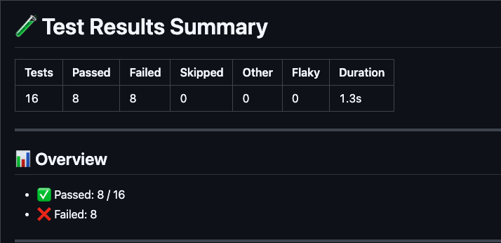

# TestZeus Run Action

A composite GitHub Action that runs automated tests using TestZeus and generates comprehensive test reports with Slack notifications.

## Features

- 🚀 Automated test execution using TestZeus CLI
- 📊 CTRF (Common Test Report Format) report generation
- 🔄 Support for multiple test cases and data files
- 📎 Asset file upload support
- 🌍 Environment configuration support for different test environments

## Prerequisites

### Repository Structure

Your repository must follow this structure:

```
your-repo/
├── tests/
│   ├── test-example1/
│   │   ├── example.feature          # Gherkin feature file
│   │   ├── test-data/               # Optional test data configurations
│   │   │   ├── case1/
│   │   │   │   ├── data.txt         # Test data file
│   │   │   │   └── assets/          # Optional asset files
│   │   │   │       └── screenshot.png
│   │   │   └── case2/
│   │   │       ├── data.txt
│   │   │       └── assets/
│   │   └── test-environments/       # Optional environment configurations
│   │       ├── case1/
│   │       │   ├── data.txt         # Environment configuration file
│   │       │   └── assets/          # Optional environment assets
│   │       │       └── config.json
│   │       └── case2/
│   │           ├── data.txt
│   │           └── assets/
│   └── test-example2/
│       ├── another.feature
│       ├── test-data/
│       │   └── case1/
│       │       └── data.txt
│       └── test-environments/       # Optional - matches test-data structure
│           └── case1/
│               └── data.txt
└── templates/
    └── ctrf-report.hbs              # Custom CTRF report template (optional)
```

### Required Files

1. **Feature Files**: Each test directory must contain a `.feature` file with Gherkin scenarios
2. **Test Data Files**: Each test case must have a `data.txt` file in the `test-data/case_name/` directory
3. **Template File**: Create `templates/ctrf-report.hbs` for custom report formatting

### Optional Files

4. **Environment Files**: Each test case can optionally have a corresponding `data.txt` file in the `test-environments/case_name/` directory
   - Environment files contain configuration data for test execution environments
   - Must follow the same directory structure as `test-data`
   - If present, will be automatically associated with the corresponding test case
   - Supports assets in the same way as test-data directories

## Setup

### 1. Required Secrets

Configure these secrets in your GitHub repository (`Settings > Secrets and variables > Actions`):

| Secret | Description | Required |
|--------|-------------|----------|
| `TESTZEUS_EMAIL` | Your TestZeus account email | ✅ Yes |
| `TESTZEUS_PASSWORD` | Your TestZeus account password | ✅ Yes |

### 2. Create CTRF Report Template (optional)



Create `templates/ctrf-report.hbs` in your repository and copy this template in to ctrf-report.hbs file. This will render similar to above image:
To create you own custom template then refer the following repos:
- [build custom CTRF template using ctrf-io repo](https://github.com/ctrf-io/github-test-reporter/tree/v1/)
- [Learn how to write handlebar for github actions](https://handlebarsjs.com/guide/)

```handlebars
# 🧪 Test Results Summary

| **Tests** | **Passed** | **Failed** | **Skipped** | **Other** | **Flaky** | **Duration** |
|----------|------------|------------|-------------|-----------|-----------|--------------|
| {{ctrf.summary.tests}} | {{ctrf.summary.passed}} | {{ctrf.summary.failed}} | {{add ctrf.summary.skipped ctrf.summary.pending}} | {{ctrf.summary.other}} | {{countFlaky ctrf.tests}} | {{formatDuration ctrf.summary.start ctrf.summary.stop}} |

---

## 📊 Overview
- ✅ Passed: {{ctrf.summary.passed}} / {{ctrf.summary.tests}}
- ❌ Failed: {{ctrf.summary.failed}}

---

## ⚙️ Execution Details
{{#if ctrf.tool.name}} **Tool**: {{ctrf.tool.name}}{{/if}}  
🔍 **Branch**: `{{github.branchName}}`  
👤 **Triggered by**: `{{github.actor}}`

---

{{#if ctrf.summary.failed}}
## ❌ Failed Tests

{{#each ctrf.tests}}
  {{#if (eq this.status "fail")}}
  ### 🔴 {{this.extra.feature_name}} - {{this.extra.scenario_name}}
  - ⏱️ Duration: {{formatDurationMs this.duration}}
  - 🔗 TestZeus Run: [View](https://prod.testzeus.app/test-runs/{{this.extra.test_run_id}})
  {{#if this.extra.test_data_id}}
  - 🧾 Test Data: [View](https://prod.testzeus.app/test-data/{{this.extra.test_data_id.[0]}})
  {{/if}}

  {{#if (getCollapseLargeReports)}}
  <details>
    <summary><strong>View Steps</strong></summary>

    {{#each this.steps}}
    - {{#if (eq this.status "fail")}}❌{{else if (eq this.status "pass")}}✅{{/if}} {{this.name}}
    {{/each}}

  </details>
  {{else}}
  - **Steps**:
    {{#each this.steps}}
    - {{#if (eq this.status "fail")}}❌{{else if (eq this.status "pass")}}✅{{/if}} {{this.name}}
  {{/each}}
  {{/if}}

  {{/if}}
{{/each}}

{{/if}}
```

## Usage

### Basic Usage

```yaml
name: Run TestZeus Tests

on:
  push:
    branches: [ main ]
  pull_request:
    branches: [ main ]

jobs:
  test:
    runs-on: ubuntu-latest
    
    steps:
    - name: Run Smoke Suite
      uses: test-zeus-ai/testzeus-create-execute@v1
      with:
          email: ${{ secrets.TESTZEUS_EMAIL }}
          password: ${{ secrets.TESTZEUS_PASSWORD }}
        
    - name: Publish Test Report
      uses: ctrf-io/github-test-reporter@v1
      with:
        report-path: 'ctrf-report.json'
        template-path: 'templates/testzeus-report.hbs'
        custom-report: true
      if: always()
```

### Advanced Usage with Custom Triggers

```yaml
name: Smoke Tests

on:
  schedule:
    - cron: '0 */6 * * *'  # Run every 6 hours
  workflow_dispatch:        # Manual trigger
  push:
    branches: [ main, staging ]

jobs:
  smoke-tests:
    runs-on: ubuntu-latest
    
    steps:
    - name: Run Smoke Suite
      uses: test-zeus-ai/testzeus-create-execute@v1
      with:
          email: ${{ secrets.TESTZEUS_EMAIL }}
          password: ${{ secrets.TESTZEUS_PASSWORD }}
        
    - name: Publish Test Report
      uses: ctrf-io/github-test-reporter@v1
      with:
        report-path: 'ctrf-report.json'
        template-path: 'templates/testzeus-report.hbs'
        custom-report: true
      if: always()
```

## Test Environments

The action supports optional test environment configurations that allow you to specify different execution environments for your tests.

### How Test Environments Work

1. **Structure**: Test environments follow the same directory structure as test-data
2. **Matching**: Each test case in `test-data/case_name/` can have a corresponding `test-environments/case_name/`
3. **Automatic Association**: When both exist, they are automatically linked during test creation
4. **Optional**: Test environments are completely optional - tests work without them

### Example Use Cases

- **Different API endpoints** for staging vs production
- **Database configurations** for different environments
- **Authentication credentials** for various test environments
- **Feature flags** or configuration settings
- **Environment-specific assets** like certificates or config files

### Sample Environment Structure

```
test-environments/
├── staging/
│   ├── data.txt              # Staging environment config
│   └── assets/
│       ├── staging-cert.pem
│       └── staging-config.json
└── production/
    ├── data.txt              # Production environment config
    └── assets/
        ├── prod-cert.pem
        └── prod-config.json
```

The environment `data.txt` files can contain:
- API base URLs
- Database connection strings
- Environment-specific variables
- Configuration parameters

## Outputs

The action generates the following outputs:

- **CTRF Report**: `ctrf-report.json` - Machine-readable test results
- **HTML Report**: Generated from the custom template
- **Console Logs**: Detailed execution logs in GitHub Actions
- **Slack Notifications**: Success/failure notifications (if configured)

### CTRF Schema

The generated CTRF report follows the **Common Test Report Format (CTRF) v1.0.0** specification. The schema includes:

- **Report metadata**: Format version, specification version, and tool information
- **Test summary**: Aggregate counts (total, passed, failed, pending, skipped, other) and execution timing
- **Individual test results**: Each test includes:
  - Test identification (name, status, duration, timing)
  - Thread/execution context information
  - File attachments (screenshots, logs, artifacts)
  - Step-by-step execution details with individual step status
  - Extended metadata (tenant IDs, test run identifiers, feature/scenario names)

This standardized format ensures compatibility with CTRF-compliant tools and enables consistent test reporting across different testing frameworks.

#### Schema Example

```json
{
  "reportFormat": "CTRF",
  "specVersion": "1.0.0",
  "results": {
    "tool": {
      "name": "testzeus",
      "version": "1.0.0"
    },
    "summary": {
      "tests": 5,
      "passed": 4,
      "failed": 1,
      "start": 1640995200,
      "stop": 1640995800
    },
    "tests": [
      {
        "name": "Login Test",
        "status": "pass",
        "duration": 2500,
        "steps": [
          {
            "name": "Enter credentials",
            "status": "pass"
          }
        ],
        "attachments": [
          {
            "name": "image.png",
            "contentType": "png",
            "path": "<path/to/image>.png"
          }
        ],
        "extra": {
          "tenantid": "abcd",
          "test_run_id": "abcd",
          "test_run_dash_id": "abcd",
          "agent_config_id": "abcd",
          "feature_name": "Authentication",
          "scenario_name": "Login to google"
        }
      }
    ]
  }
}
```

## Troubleshooting

### Common Issues

1. **"No .feature file found"**
   - Ensure each test directory has a `.feature` file
   - Check file naming and extensions

2. **"test-data dir not found"**
   - Verify the `test-data` directory structure
   - Each test must have a `test-data` subdirectory

3. **"Login failed"**
   - Check your TestZeus credentials in secrets
   - Ensure your TestZeus account is active

4. **Template errors**
   - Ensure `templates/ctrf-report.hbs` exists
   - Check Handlebars syntax in your template

5. **Test environment issues**
   - Test environments are optional - missing directories won't cause failures
   - Ensure `test-environments` structure matches `test-data` structure
   - Each environment case directory must have its own `data.txt` file

### Debug Mode

Add this step before the action to enable debug logging:

```yaml
- name: Enable Debug
  run: echo "ACTIONS_STEP_DEBUG=true" >> $GITHUB_ENV
```

## Contributing

1. Fork the repository
2. Create a feature branch
3. Make your changes
4. Test with a sample repository
5. Submit a pull request

## License

This project is licensed under the MIT License - see the [LICENSE](LICENSE) file for details.

## Support

For issues related to:
- **TestZeus CLI**: Contact TestZeus support
- **This Action**: Open an issue in this repository
- **GitHub Actions**: Check GitHub's documentation
