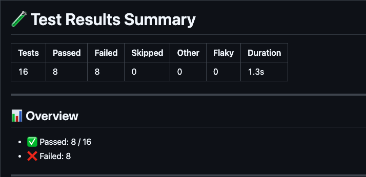

# TestZeus Create & Execute

CI packaging that creates TestZeus tests from a `./tests` folder, runs them via the TestZeus CLI, and emits a CTRF report.

## Start here

| Goal | Doc |
|------|-----|
| **End-to-end setup** (GitHub / GitLab / Bitbucket) | [docs/CONSUMER_SETUP.md](docs/CONSUMER_SETUP.md) |
| **AI coding agents** | [AGENTS.md](AGENTS.md) · [CLAUDE.md](CLAUDE.md) |
| **Failures** | [docs/TROUBLESHOOTING.md](docs/TROUBLESHOOTING.md) |
| **Minimal fixture** | [examples/smoke/](examples/smoke/) |
| **Cross-SCM smoke repos** (validate a branch/tag) | [Self-test & validation consumers](#self-test--validation-consumers) |

**Supported CI systems**

| CI | Packaging | How to run |
|----|-----------|------------|
| GitHub Actions | Composite Action (`action.yml`) | `uses: test-zeus-ai/testzeus-create-execute@v1` |
| GitLab CI | Include / CI Component | [`templates/gitlab-ci.yml`](templates/gitlab-ci.yml) or [`templates/create-execute/`](templates/create-execute/) |
| Bitbucket Pipelines | Pipeline snippet / Pipe | [`templates/bitbucket-pipelines.yml`](templates/bitbucket-pipelines.yml) or [`bitbucket-pipe/`](bitbucket-pipe/) |

All platforms share the same orchestrator: [`scripts/entrypoint.sh`](scripts/entrypoint.sh) → [`scripts/create_test_report.sh`](scripts/create_test_report.sh).

> **AI coding agents:** follow [AGENTS.md](AGENTS.md) and implement [docs/CONSUMER_SETUP.md](docs/CONSUMER_SETUP.md) — do not invent a separate CI path.

## Features

- Automated test execution using TestZeus CLI
- CTRF (Common Test Report Format) report generation
- Support for multiple test cases and data files
- Asset file upload support
- Environment configuration support for different test environments
- Same `./tests` layout on GitHub, GitLab, and Bitbucket

## Prerequisites

### Repository Structure

Your repository must follow this structure:

```
your-repo/
├── tests/
│   ├── test-login/
│   │   ├── login.feature            # Gherkin feature file
│   │   ├── environment/             # Optional per-test environment
│   │   │   ├── data.txt             # Environment configuration
│   │   │   ├── extra.json           # Optional extra fields (e.g., connected_env)
│   │   │   └── assets/              # Optional environment assets
│   │   │       └── config.json
│   │   ├── hypermind/               # Optional Hypermind code blocks
│   │   │   ├── helper.py            # Code block file 1
│   │   │   └── utils.js             # Code block file 2
│   │   └── test-data/               # Optional test data configurations
│   │       ├── valid-user/          # Test case 1
│   │       │   ├── data.txt         # Test data file
│   │       │   └── assets/          # Optional asset files
│   │       │       └── profile.png
│   │       ├── admin-user/          # Test case 2
│   │       │   ├── data.txt
│   │       │   └── assets/
│   │       └── guest-user/          # Test case 3
│   │           └── data.txt
│   ├── test-checkout/
│   │   ├── checkout.feature
│   │   ├── environment/
│   │   │   ├── data.txt
│   │   │   └── extra.json           # {"connected_env": "env-id-123"}
│   │   └── test-data/
│   │       ├── single-item/         # Multiple cases assigned to one test
│   │       │   └── data.txt
│   │       └── multiple-items/
│   │           └── data.txt
│   └── test-search/
│       ├── search.feature           # Test without test-data (feature file only)
│       └── hypermind/               # Optional Hypermind code blocks
│           └── search-helper.py
└── templates/
    └── ctrf-report.hbs              # Custom CTRF report template (optional)
```

### Required Files

1. **Feature Files**: Each test directory must contain a `.feature` file with Gherkin scenarios
2. **Test Data Files**: Each test case must have a `data.txt` file in the `test-data/case_name/` directory
   - Multiple test-data cases can exist per test (zero, one, or multiple)
   - All test-data cases are assigned to a single test record
3. **Template File**: Create `templates/ctrf-report.hbs` for custom report formatting

### Optional Files

4. **Per-Test Environment**: Each test can have its own `environment/` directory
   - Contains `data.txt` for environment configuration specific to that test
   - Supports `extra.json` for additional fields like connected environments
   - Supports assets in `environment/assets/` directory
   
5. **Hypermind Code Blocks**: Each test can have a `hypermind/` directory
   - Contains code files that will be uploaded as Hypermind code blocks
   - Each file in the directory becomes a separate code block
   - Automatically linked to the test via `--hypermind-code-blocks` parameter

## Entity naming

TestZeus entity names (tests, test-data, environments, hypermind code blocks)
must match: **only lowercase letters, numbers, and underscores; must start with
a letter** (same rule as UIX `validateEntityName`).

create-execute sanitizes folder/case names before create — hyphens become
underscores. Example:

```text
tests/test-file_upload/test-data/sf-data/data.txt
  → test_data name: test_file_upload_sf_data_<unix_seed>
```

## Test Creation Logic

The action follows this logic for creating tests:

### 1. **Per-Test Environment** (Optional)
- Each test can have its own `environment/` directory with specific configuration
- Environment supports:
  - `data.txt`: Environment configuration data
  - `extra.json`: Additional fields (e.g., `{"connected_env": "env-id-123"}`)
  - `assets/`: Environment-specific files
- The `connected_env` field in `extra.json` is used to link to other environments via the `--connected-environments` parameter

### 2. **Hypermind Code Blocks** (Optional)
- Each test can have a `hypermind/` directory containing code files
- All files in this directory are uploaded as separate Hypermind code blocks
- Code blocks are automatically linked to the test via the `--hypermind-code-blocks` parameter

### 3. **Test Creation Per Directory**
For each `tests/test-*` directory:

- **Feature File Only**: If no `test-data/` directory exists, creates a test with just the feature file
- **With Test Data**: If `test-data/` directory exists:
  1. Creates individual test-data records for each case directory
  2. Collects all test-data IDs from that test
  3. Creates a single test record with ALL test-data IDs assigned
  4. Associates the per-test environment (if exists)
  5. Links Hypermind code blocks (if exist)

### 4. **Example Test Creation**
```
test-login/
├── login.feature
├── environment/
│   ├── data.txt                    # Environment config
│   ├── extra.json                  # {"connected_env": "other-env-id"}
│   └── assets/
│       └── cert.pem
├── hypermind/
│   ├── helper.py                   → Creates Hypermind block: hyper_001
│   └── utils.js                    →   (both files in single block)
└── test-data/
    ├── valid-user/data.txt         → Creates test-data ID: data_001
    ├── admin-user/data.txt         → Creates test-data ID: data_002  
    └── guest-user/data.txt         → Creates test-data ID: data_003

Result: One test record with:
  - data: "data_001,data_002,data_003"
  - environment: env_001 (with connected environment linked)
  - hypermind-code-blocks: "hyper_001" (contains both files)
```

## Setup

### 1. Required Secrets

Configure these secrets in your GitHub repository (`Settings > Secrets and variables > Actions`):

| Secret | Description | Required |
|--------|-------------|----------|
| `TESTZEUS_TOKEN` | PocketBase JWT from TestZeus (preferred) | Preferred |
| `TESTZEUS_EMAIL` | TestZeus account email | Fallback if no token |
| `TESTZEUS_PASSWORD` | TestZeus account password | Fallback if no token |

Provide **either** `TESTZEUS_TOKEN` **or** both email and password.

## Inputs

The action accepts the following input parameters:

| Input | Description | Required | Default |
|-------|-------------|----------|---------|
| `token` | TestZeus PocketBase JWT (preferred) | Preferred | — |
| `email` | TestZeus login email (fallback) | Fallback | — |
| `password` | TestZeus login password (fallback) | Fallback | — |
| `name` | Name for the test run group | No | `Smoke action suite` |
| `execution_mode` | Execution mode (`lenient` or `strict`) | No | `lenient` |
| `filename` | CTRF report filename | No | `ctrf-report.json` |
| `notification_channels` | Comma-separated channel IDs | No | — |

### Execution Modes

- **`lenient`**: Tests continue running even if some fail, providing a complete overview of all test results
- **`strict`**: Test execution stops at the first failure, useful for fail-fast scenarios

### 2. Create CTRF Report Template (optional)



Create `templates/ctrf-report.hbs` in your repository and copy this template in to ctrf-report.hbs file. This will render similar to above image:
To create you own custom template then refer the following repos:
- [build custom CTRF template using ctrf-io repo](https://github.com/ctrf-io/github-test-reporter/tree/v1/)
- [Learn how to write handlebar for github actions](https://handlebarsjs.com/guide/)

```handlebars
# 🧪 Test Results Summary

| **Tests** | **Passed** | **Failed** | **Skipped** | **Other** | **Flaky** | **Duration** |
|----------|------------|------------|-------------|-----------|-----------|--------------|
| {{ctrf.summary.tests}} | {{ctrf.summary.passed}} | {{ctrf.summary.failed}} | {{add ctrf.summary.skipped ctrf.summary.pending}} | {{ctrf.summary.other}} | {{countFlaky ctrf.tests}} | {{formatDuration ctrf.summary.start ctrf.summary.stop}} |

---

## 📊 Overview
- ✅ Passed: {{ctrf.summary.passed}} / {{ctrf.summary.tests}}
- ❌ Failed: {{ctrf.summary.failed}}

---

## ⚙️ Execution Details
{{#if ctrf.tool.name}} **Tool**: {{ctrf.tool.name}}{{/if}}  
🔍 **Branch**: `{{github.branchName}}`  
👤 **Triggered by**: `{{github.actor}}`

---

{{#if ctrf.summary.failed}}
## ❌ Failed Tests

{{#each ctrf.tests}}
  {{#if (eq this.status "fail")}}
  ### 🔴 {{this.extra.feature_name}} - {{this.extra.scenario_name}}
  - ⏱️ Duration: {{formatDurationMs this.duration}}
  - 🔗 TestZeus Run: [View](https://prod.testzeus.app/test-runs/{{this.extra.test_run_id}})
  {{#if this.extra.test_data_id}}
  - 🧾 Test Data: [View](https://prod.testzeus.app/test-data/{{this.extra.test_data_id.[0]}})
  {{/if}}

  {{#if (getCollapseLargeReports)}}
  <details>
    <summary><strong>View Steps</strong></summary>

    {{#each this.steps}}
    - {{#if (eq this.status "fail")}}❌{{else if (eq this.status "pass")}}✅{{/if}} {{this.name}}
    {{/each}}

  </details>
  {{else}}
  - **Steps**:
    {{#each this.steps}}
    - {{#if (eq this.status "fail")}}❌{{else if (eq this.status "pass")}}✅{{/if}} {{this.name}}
  {{/each}}
  {{/if}}

  {{/if}}
{{/each}}

{{/if}}
```

## Shared environment variables

Adapters map CI secrets/inputs into these env vars before calling `scripts/entrypoint.sh`:

| Variable | Required | Default | Description |
|----------|----------|---------|-------------|
| `TESTZEUS_TOKEN` | Preferred | — | PocketBase JWT; uses CLI `session-exchange` |
| `TESTZEUS_EMAIL` | Fallback | — | Login email when token is unset |
| `TESTZEUS_PASSWORD` | Fallback | — | Login password when token is unset |
| `TEST_RUN_NAME` | No | `Smoke action suite` | Test run group name |
| `EXECUTION_MODE` | No | `lenient` | `lenient` or `strict` |
| `REPORT_FILENAME` | No | `ctrf-report.json` | CTRF filename under `downloads/` |
| `NOTIFICATION_CHANNELS` | No | _(empty)_ | Comma-separated channel IDs |
| `TESTZEUS_SKIP_INSTALL` | No | _(unset)_ | Set `true` to skip `pip install` (Bitbucket Pipe image) |
| `TESTZEUS_PROFILE` | No | `ci` | CLI profile name used for token auth |
| `TESTZEUS_CLI_VERSION` | No | `0.0.30` | Pinned `testzeus-cli` version installed by entrypoint |

The runner must have `bash`, `pip`/`python`, and the `jq` binary available.

CTRF report path: **`downloads/<REPORT_FILENAME>`** (default `downloads/ctrf-report.json`).

## Versioning

Pin consumers to a release tag, not `main`:

| Consumer | Pin |
|----------|-----|
| GitHub Action | `uses: test-zeus-ai/testzeus-create-execute@v1` |
| GitLab / Bitbucket clone | `TESTZEUS_ACTION_REF=v1` (default in templates) |
| Bitbucket Pipe image | `ghcr.io/test-zeus-ai/testzeus-create-execute:v1` |
| TestZeus CLI (PyPI) | `testzeus-cli==0.0.30` (override with `TESTZEUS_CLI_VERSION`) |

Maintainers: push a semver tag (`v1.2.3`). The `release` workflow publishes the GHCR image and a GitHub Release. **Floating tags move:** each `v*` release updates `@v1` / image `:v1` and `:latest` to that build — call this out in release notes (the workflow body already does). Pin a full semver if you need a freeze. First `v1` after the multi-SCM merge must point at a commit that includes `scripts/entrypoint.sh`. Bump the pinned CLI in `scripts/lib.sh` + `bitbucket-pipe/Dockerfile` deliberately and note it in release notes.

Local Pipe debug: see [`bitbucket-pipe/README.md`](bitbucket-pipe/README.md) (`WORKDIR` mount path).

## Self-test & validation consumers

This repo includes [`examples/smoke/`](examples/smoke/) and a `workflow_dispatch` workflow [`.github/workflows/self-test.yml`](.github/workflows/self-test.yml).

1. Add repo secrets: `TESTZEUS_TOKEN` (or email/password)
2. Actions → **self-test** → Run workflow
3. Download the CTRF artifact from the run

Locally:

```bash
ln -sfn examples/smoke/tests tests
export TESTZEUS_TOKEN='...'
./scripts/entrypoint.sh
```

### Cross-SCM smoke repos (reference)

Use these minimal consumer repos to validate a branch/tag of create-execute end-to-end. Pin `TESTZEUS_ACTION_REF` / `uses:` to the branch under test (e.g. a PR branch), then flip back to `@v1` after release.

| SCM | Repo | How to run |
|-----|------|------------|
| **GitHub** | [test-zeus-ai/create-execute-gh-smoke](https://github.com/test-zeus-ai/create-execute-gh-smoke) (private) | Actions → **create-execute smoke** → Run workflow |
| **GitLab** | [pritish.budhiraja1/testzeus-create-execute-smoke](https://gitlab.com/pritish.budhiraja1/testzeus-create-execute-smoke) | Push or trigger pipeline on `main` |
| **Bitbucket** | [testzeus/testzeus-create-execute-smoke](https://bitbucket.org/testzeus/testzeus-create-execute-smoke) | Push or Run pipeline on `main` |

Larger / scheduled platform suite (also consumes this action): [test-zeus-ai/platform-test-rig](https://github.com/test-zeus-ai/platform-test-rig).

Each small smoke repo has a single `tests/test-smoke/` fixture (`example.com`). Secrets: `TESTZEUS_EMAIL` / `TESTZEUS_PASSWORD` (or `TESTZEUS_TOKEN` where supported).

## Usage

### GitHub Actions — Basic Usage

Full walkthrough: [docs/CONSUMER_SETUP.md](docs/CONSUMER_SETUP.md#a-github-actions).

```yaml
name: Run TestZeus Tests

on:
  push:
    branches: [ main ]
  pull_request:
    branches: [ main ]

jobs:
  test:
    runs-on: ubuntu-latest
    
    steps:
    - uses: actions/checkout@v4

    - name: Run Smoke Suite
      uses: test-zeus-ai/testzeus-create-execute@v1
      with:
        token: ${{ secrets.TESTZEUS_TOKEN }}
        # Or fallback:
        # email: ${{ secrets.TESTZEUS_EMAIL }}
        # password: ${{ secrets.TESTZEUS_PASSWORD }}
        name: 'CI Smoke Tests'
        execution_mode: 'lenient'
        filename: 'test-results.json'
        
    - name: Publish Test Report
      uses: ctrf-io/github-test-reporter@v1
      with:
        report-path: 'downloads/test-results.json'
        template-path: 'templates/testzeus-report.hbs'
        custom-report: true
      if: always()
```

### GitLab CI

Full walkthrough: [docs/CONSUMER_SETUP.md](docs/CONSUMER_SETUP.md#b-gitlab-ci).

Set masked `TESTZEUS_TOKEN` (preferred) or `TESTZEUS_EMAIL` + `TESTZEUS_PASSWORD`.

**Include (remote template, pinned to `v1`):**

The template exports only the hidden job `.testzeus-create-execute`. Declare a concrete job that `extends` it:

```yaml
include:
  - remote: 'https://raw.githubusercontent.com/test-zeus-ai/testzeus-create-execute/v1/templates/gitlab-ci.yml'

testzeus-create-execute:
  extends: .testzeus-create-execute
  stage: test
  variables:
    TESTZEUS_ACTION_REF: "v1"
    TEST_RUN_NAME: "CI Smoke Tests"
    EXECUTION_MODE: "lenient"
    REPORT_FILENAME: "ctrf-report.json"
  rules:
    - if: $CI_PIPELINE_SOURCE == "merge_request_event"
    - if: $CI_COMMIT_BRANCH == $CI_DEFAULT_BRANCH
```

The job clones this repository at `TESTZEUS_ACTION_REF` (shell default `v1`), runs `scripts/entrypoint.sh`, and uploads `downloads/` as a job artifact. Confirm the log shows `Cloning testzeus-create-execute@v1`. If you see `chmod: ... entrypoint.sh: No such file`, the wrong ref was cloned — see [docs/TROUBLESHOOTING.md](docs/TROUBLESHOOTING.md).

**CI/CD Component** (when published / vendored):

```yaml
include:
  - component: $CI_SERVER_FQDN/test-zeus-ai/testzeus-create-execute/create-execute@v1
    inputs:
      name: "CI Smoke Tests"
      execution_mode: "lenient"
      filename: "ctrf-report.json"
      action_ref: "v1"
```

Pretty MR comments are not included — use artifacts / a GitLab report parser rather than `ctrf-io/github-test-reporter`.

See [`templates/gitlab-ci.yml`](templates/gitlab-ci.yml) and [`templates/create-execute/template.yml`](templates/create-execute/template.yml).

### Bitbucket Pipelines

Full walkthrough: [docs/CONSUMER_SETUP.md](docs/CONSUMER_SETUP.md#c-bitbucket-pipelines).

Set secured `TESTZEUS_TOKEN` (preferred) or email/password, then copy [`templates/bitbucket-pipelines.yml`](templates/bitbucket-pipelines.yml).

**Pipeline snippet (clone + entrypoint):**

```yaml
image: python:3.12-slim

pipelines:
  default:
    - step:
        name: TestZeus create-execute
        script:
          - apt-get update && apt-get install -y --no-install-recommends jq git ca-certificates
          - export TESTZEUS_ACTION_REF="${TESTZEUS_ACTION_REF:-v1}"
          - export TEST_RUN_NAME="${TEST_RUN_NAME:-Smoke action suite}"
          - export EXECUTION_MODE="${EXECUTION_MODE:-lenient}"
          - export REPORT_FILENAME="${REPORT_FILENAME:-ctrf-report.json}"
          - git clone --depth 1 --branch "${TESTZEUS_ACTION_REF}" https://github.com/test-zeus-ai/testzeus-create-execute.git /tmp/testzeus-create-execute
          - /tmp/testzeus-create-execute/scripts/entrypoint.sh
        artifacts:
          - downloads/**
```

**Bitbucket Pipe** (GHCR image from the `release` workflow):

```yaml
script:
  - pipe: docker://ghcr.io/test-zeus-ai/testzeus-create-execute:v1
    variables:
      TESTZEUS_TOKEN: $TESTZEUS_TOKEN
      TEST_RUN_NAME: "CI Smoke Tests"
      EXECUTION_MODE: "lenient"
      REPORT_FILENAME: "ctrf-report.json"
```

Build locally from the repo root:

```bash
docker build -f bitbucket-pipe/Dockerfile -t ghcr.io/test-zeus-ai/testzeus-create-execute:local .
```

### Advanced Usage with Custom Triggers

```yaml
name: Smoke Tests

on:
  schedule:
    - cron: '0 */6 * * *'  # Run every 6 hours
  workflow_dispatch:        # Manual trigger
  push:
    branches: [ main, staging ]

jobs:
  smoke-tests:
    runs-on: ubuntu-latest
    
    steps:
    - name: Run Smoke Suite
      uses: test-zeus-ai/testzeus-create-execute@v1
      with:
        token: ${{ secrets.TESTZEUS_TOKEN }}
        name: 'Scheduled Smoke Tests'
        execution_mode: 'strict'
        
    - name: Publish Test Report
      uses: ctrf-io/github-test-reporter@v1
      with:
        report-path: 'downloads/ctrf-report.json'
        template-path: 'templates/testzeus-report.hbs'
        custom-report: true
      if: always()
```

### Usage with Different Execution Modes

```yaml
name: Multi-Environment Tests

on:
  workflow_dispatch:
    inputs:
      environment:
        description: 'Target environment'
        required: true
        default: 'staging'
        type: choice
        options:
        - staging
        - production

jobs:
  test-staging:
    if: github.event.inputs.environment == 'staging'
    runs-on: ubuntu-latest
    steps:
    - name: Run Staging Tests
      uses: test-zeus-ai/testzeus-create-execute@v1
      with:
        token: ${{ secrets.TESTZEUS_TOKEN }}
        name: 'Staging Environment Tests'
        execution_mode: 'lenient'
        
  test-production:
    if: github.event.inputs.environment == 'production'
    runs-on: ubuntu-latest
    steps:
    - name: Run Production Tests
      uses: test-zeus-ai/testzeus-create-execute@v1
      with:
        token: ${{ secrets.TESTZEUS_TOKEN }}
        name: 'Production Environment Tests'
        execution_mode: 'strict'
```

## Per-Test Environment Configuration

The action supports optional per-test environment configuration, allowing each test to have its own isolated environment settings.

### How Per-Test Environments Work

1. **Test-Specific**: Each test directory can contain its own `environment/` directory
2. **Isolated Configuration**: Each environment is independent and specific to one test
3. **Automatic Association**: The environment is automatically linked to its corresponding test
4. **Optional**: Per-test environments are completely optional - tests work without them

### Environment Structure

```
tests/test-login/
├── login.feature
└── environment/
    ├── data.txt              # Environment configuration
    ├── extra.json            # Optional extra fields
    └── assets/               # Optional environment assets
        ├── api-cert.pem
        └── config.json
```

### extra.json Format

The `extra.json` file allows you to specify additional environment properties:

```json
{
  "connected_env": "environment-id-or-name-123"
}
```

**Fields:**
- `connected_env`: ID or name of another environment to link via the `--connected-environments` parameter
- Additional custom fields can be added as needed

### Example Use Cases

- **Test-Specific URLs**: Different API endpoints for different test suites
- **Authentication Credentials**: Separate credentials per test type
- **Environment Links**: Connect staging/production environments using `connected_env`
- **Feature Flags**: Test-specific feature configurations
- **Database Configs**: Per-test database connection strings
- **Certificates**: Test-specific SSL/TLS certificates

### Connected Environments

Use the `connected_env` field in `extra.json` to link environments together:

```json
{
  "connected_env": "prod-env-id"
}
```

This automatically calls:
```bash
testzeus environments update <env-id> --connected-environments "prod-env-id"
```

### Sample Structure with Multiple Tests

```
tests/
├── test-login/
│   ├── login.feature
│   ├── environment/
│   │   ├── data.txt          # Login-specific environment
│   │   ├── extra.json        # {"connected_env": "base-env-id"}
│   │   └── assets/
│   │       └── auth-cert.pem
│   └── test-data/
│       └── valid-user/
│           └── data.txt
├── test-checkout/
│   ├── checkout.feature
│   ├── environment/
│   │   ├── data.txt          # Checkout-specific environment
│   │   └── assets/
│   │       └── payment-config.json
│   └── test-data/
│       ├── guest-checkout/
│       │   └── data.txt
│       └── member-checkout/
│           └── data.txt
└── test-admin/
    ├── admin.feature
    └── environment/
        ├── data.txt          # Admin-specific environment
        └── extra.json        # {"connected_env": "admin-base-env"}
```

Each test's `environment/data.txt` file can contain:
- Test-specific API endpoints
- Authentication tokens or credentials
- Environment-specific variables
- Configuration parameters unique to that test
- Database connection strings

## Hypermind Code Blocks

The action supports Hypermind code blocks, allowing you to attach reusable code snippets, helper functions, or utilities to your tests.

### How Hypermind Code Blocks Work

1. **Per-Test Directory**: Each test can have a `hypermind/` directory containing code files
2. **Single Code Block**: All files in the directory are uploaded together as one code block
3. **Automatic Linking**: The code block is automatically associated with the test via `--hypermind-code-blocks`
4. **Optional**: Hypermind directories are completely optional - tests work without them

### Hypermind Structure

```
tests/test-login/
├── login.feature
└── hypermind/
    ├── helper.py             # Python helper functions
    ├── utils.js              # JavaScript utilities
    └── config.yaml           # Configuration code
```

### Example Use Cases

- **Helper Functions**: Reusable code for data manipulation or validation
- **API Clients**: Custom API interaction code
- **Data Generators**: Functions to generate test data
- **Utilities**: Common utilities shared across test steps
- **Configuration Code**: Programmatic configuration setup
- **Parsers**: Custom parsers for test data or responses

### How It Works

When the action runs:
1. Scans the `hypermind/` directory for all files
2. Creates a single Hypermind code block with all files using:
   ```bash
   testzeus hypermind-code-blocks create --name "test-name-timestamp" --status "ready" --file "path/to/file1" --file "path/to/file2" ...
   ```
3. Associates it with the test via:
   ```bash
   testzeus tests create ... --hypermind-code-blocks "id"
   ```

### Sample Structure with Hypermind

```
tests/
├── test-login/
│   ├── login.feature
│   ├── hypermind/
│   │   ├── auth-helper.py        # Authentication utilities
│   │   └── token-validator.js    # Token validation logic
│   └── test-data/
│       └── valid-user/
│           └── data.txt
├── test-checkout/
│   ├── checkout.feature
│   ├── hypermind/
│   │   ├── payment-processor.py  # Payment processing code
│   │   ├── cart-utils.js         # Shopping cart utilities
│   │   └── discount-calc.py      # Discount calculation logic
│   └── test-data/
│       └── single-item/
│           └── data.txt
└── test-search/
    ├── search.feature
    └── hypermind/
        └── search-algorithm.py    # Custom search logic
```

### Supported File Types

Hypermind code blocks support any text-based file format:
- Python (`.py`)
- JavaScript (`.js`)
- TypeScript (`.ts`)
- YAML/JSON configuration files
- Shell scripts (`.sh`)
- Any other text-based code files

## Complete Example: All Features Combined

Here's a comprehensive example showing how to use environments, Hypermind code blocks, and test data together:

```
your-repo/
├── tests/
│   ├── test-api-authentication/
│   │   ├── authentication.feature              # Feature file
│   │   ├── environment/
│   │   │   ├── data.txt                        # API base URLs, auth endpoints
│   │   │   ├── extra.json                      # {"connected_env": "base-api-env"}
│   │   │   └── assets/
│   │   │       ├── api-certificate.pem         # SSL certificate
│   │   │       └── oauth-config.json           # OAuth configuration
│   │   ├── hypermind/
│   │   │   ├── jwt-helper.py                   # JWT token utilities
│   │   │   ├── auth-validator.js               # Authentication validation
│   │   │   └── token-refresh.py                # Token refresh logic
│   │   └── test-data/
│   │       ├── admin-login/
│   │       │   ├── data.txt                    # Admin credentials
│   │       │   └── assets/
│   │       │       └── admin-profile.json
│   │       ├── user-login/
│   │       │   └── data.txt                    # Regular user credentials
│   │       └── guest-access/
│   │           └── data.txt                    # Guest access token
│   │
│   ├── test-payment-processing/
│   │   ├── payment.feature
│   │   ├── environment/
│   │   │   ├── data.txt                        # Payment gateway URLs
│   │   │   ├── extra.json                      # {"connected_env": "prod-payment-env"}
│   │   │   └── assets/
│   │   │       └── payment-gateway-cert.pem
│   │   ├── hypermind/
│   │   │   ├── payment-calculator.py           # Payment calculations
│   │   │   ├── tax-engine.js                   # Tax calculation logic
│   │   │   └── currency-converter.py           # Currency conversion
│   │   └── test-data/
│   │       ├── credit-card-payment/
│   │       │   ├── data.txt
│   │       │   └── assets/
│   │       │       └── card-details.json
│   │       ├── paypal-payment/
│   │       │   └── data.txt
│   │       └── crypto-payment/
│   │           └── data.txt
│   │
│   └── test-simple-search/
│       ├── search.feature                      # Simple test with no test-data
│       ├── environment/
│       │   └── data.txt                        # Search API configuration
│       └── hypermind/
│           └── search-ranker.py                # Search ranking algorithm
│
└── templates/
    └── ctrf-report.hbs
```

### What Happens During Execution

For `test-api-authentication`:

1. **Environment Creation**:
   ```bash
   testzeus environments create --name "test-api-authentication-env-1234567890" \
     --data-file "./tests/test-api-authentication/environment/data.txt" \
     --status "ready"
   # Returns: env_001
   ```

2. **Connected Environment Linking**:
   ```bash
   testzeus environments update env_001 \
     --connected-environments "base-api-env"
   ```

3. **Environment Assets Upload**:
   ```bash
   testzeus environments upload-file env_001 \
     "./tests/test-api-authentication/environment/assets/api-certificate.pem"
   testzeus environments upload-file env_001 \
     "./tests/test-api-authentication/environment/assets/oauth-config.json"
   ```

4. **Hypermind Code Blocks Creation**:
   ```bash
   testzeus hypermind-code-blocks create \
     --name "test-api-authentication-1234567890" \
     --status "ready" \
     --file "./tests/test-api-authentication/hypermind/jwt-helper.py" \
     --file "./tests/test-api-authentication/hypermind/auth-validator.js" \
     --file "./tests/test-api-authentication/hypermind/token-refresh.py"
   # Returns: hyper_001
   ```

5. **Test Data Creation**:
   ```bash
   testzeus test-data create \
     --name "test-api-authentication-admin-login-1234567890" \
     --data-file "./tests/test-api-authentication/test-data/admin-login/data.txt" \
     --status "ready"
   # Returns: data_001
   
   testzeus test-data upload-file data_001 \
     "./tests/test-api-authentication/test-data/admin-login/assets/admin-profile.json"
   
   # Similar for user-login (data_002) and guest-access (data_003)
   ```

6. **Test Creation with All Components**:
   ```bash
   testzeus tests create \
     --name "test-api-authentication-1234567890" \
     --feature-file "./tests/test-api-authentication/authentication.feature" \
     --data "data_001,data_002,data_003" \
     --environment "env_001" \
     --hypermind-code-blocks "hyper_001" \
     --status "ready"
   # Returns: test_001
   ```

### Key Benefits of This Structure

1. **Isolation**: Each test has its own environment configuration
2. **Reusability**: Hypermind code blocks provide shared logic
3. **Flexibility**: Connect related environments via `connected_env`
4. **Organization**: Clear separation of concerns (environment, code, data)
5. **Scalability**: Easy to add new tests without affecting existing ones

## Outputs

The action generates the following outputs:

- **CTRF Report**: Stored in `downloads/` directory with configurable filename (default: `downloads/ctrf-report.json`) - Machine-readable test results
- **HTML Report**: Generated from the custom template
- **Console Logs**: Detailed execution logs in GitHub Actions
- **Slack Notifications**: Success/failure notifications (if configured)

### Report Location

After the action completes, the CTRF report will be available at:
- **Default path**: `downloads/ctrf-report.json`
- **Custom path**: `downloads/{your-custom-filename}` (when using the `filename` input parameter)

### CTRF Schema

The generated CTRF report follows the **Common Test Report Format (CTRF) v1.0.0** specification. The schema includes:

- **Report metadata**: Format version, specification version, and tool information
- **Test summary**: Aggregate counts (total, passed, failed, pending, skipped, other) and execution timing
- **Individual test results**: Each test includes:
  - Test identification (name, status, duration, timing)
  - Thread/execution context information
  - File attachments (screenshots, logs, artifacts)
  - Step-by-step execution details with individual step status
  - Extended metadata (tenant IDs, test run identifiers, feature/scenario names)

This standardized format ensures compatibility with CTRF-compliant tools and enables consistent test reporting across different testing frameworks.

#### Schema Example

```json
{
  "reportFormat": "CTRF",
  "specVersion": "1.0.0",
  "results": {
    "tool": {
      "name": "testzeus",
      "version": "1.0.0"
    },
    "summary": {
      "tests": 5,
      "passed": 4,
      "failed": 1,
      "start": 1640995200,
      "stop": 1640995800
    },
    "tests": [
      {
        "name": "Login Test",
        "status": "pass",
        "duration": 2500,
        "steps": [
          {
            "name": "Enter credentials",
            "status": "pass"
          }
        ],
        "attachments": [
          {
            "name": "image.png",
            "contentType": "png",
            "path": "<path/to/image>.png"
          }
        ],
        "extra": {
          "tenantid": "abcd",
          "test_run_id": "abcd",
          "test_run_dash_id": "abcd",
          "agent_config_id": "abcd",
          "feature_name": "Authentication",
          "scenario_name": "Login to google"
        }
      }
    ]
  }
}
```

## Troubleshooting

Platform-agnostic runbook (including GitLab wrong-ref / missing `entrypoint.sh`): **[docs/TROUBLESHOOTING.md](docs/TROUBLESHOOTING.md)**.

### Common Issues

1. **"No .feature file found"**
   - Ensure each test directory has a `.feature` file
   - Check file naming and extensions

2. **"test-data dir not found"**
   - This is optional - tests can run with just a feature file
   - Verify the `test-data` directory structure if you want to use test data

3. **"Login failed"**
   - Check your TestZeus credentials in secrets
   - Prefer `TESTZEUS_TOKEN`; ensure email/password both set if using fallback
   - Ensure your TestZeus account is active

4. **Template errors**
   - Ensure `templates/ctrf-report.hbs` exists when using the GitHub reporter with a custom template
   - Check Handlebars syntax in your template

5. **Per-test environment issues**
   - Per-test environments are optional - missing directory won't cause failures
   - Ensure `environment/data.txt` exists if you create the `environment/` directory
   - Validate `extra.json` syntax if using connected environments
   - Environment assets are stored in `environment/assets/`
   - Each test can have its own independent environment configuration

6. **Hypermind code block issues**
   - Hypermind directories are optional - missing directory won't cause failures
   - Files in `hypermind/` are uploaded as one code block with multiple `--file` args
   - Check that code files are readable and not binary
   - Verify file permissions if upload fails

7. **GitLab clones old tag / missing `scripts/entrypoint.sh`**
   - Set `TESTZEUS_ACTION_REF` on the **job** variables block
   - See [docs/TROUBLESHOOTING.md](docs/TROUBLESHOOTING.md)

### Debug Mode

Add this step before the action to enable debug logging:

```yaml
- name: Enable Debug
  run: echo "ACTIONS_STEP_DEBUG=true" >> $GITHUB_ENV
```

## Contributing

1. Fork the repository
2. Create a feature branch
3. Make your changes
4. Test with a sample repository
5. Submit a pull request

## License

This project is licensed under the MIT License - see the [LICENSE](LICENSE) file for details.

## Support

For issues related to:
- **TestZeus CLI**: Contact TestZeus support
- **This repo (Action / GitLab / Bitbucket adapters)**: Open an issue in this repository
- **GitHub Actions / GitLab CI / Bitbucket Pipelines**: See the respective platform docs

Prefer `TESTZEUS_TOKEN` in CI. Pin consumers to `@v1` / `TESTZEUS_ACTION_REF=v1`. Use **self-test** to validate releases.

**Docs for customers & agents:** [docs/CONSUMER_SETUP.md](docs/CONSUMER_SETUP.md) · [AGENTS.md](AGENTS.md) · [docs/TROUBLESHOOTING.md](docs/TROUBLESHOOTING.md)
